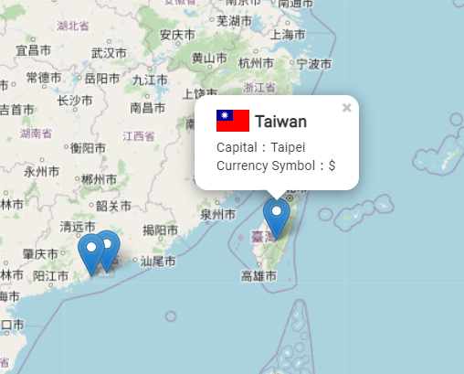

# Country Map

## Demo
[demo](https://littleplumule.github.io/country-map/)

## Description
串接 [REST Country](https://restcountries.com/) 並使用 [Leaflet](https://www.npmjs.com/package/leaflet) 地圖套件實作

功能: 
- 顯示國家國旗
- 顯示國家姓名
- 顯示國家首都
- 顯示國家貨幣

## clone
`git clone https://github.com/littlePlumule/country-map.git`

`cd country-map`

`npm install`

## environment 

`VITE_COUTRIES_API`
## preview
`npm run dev`